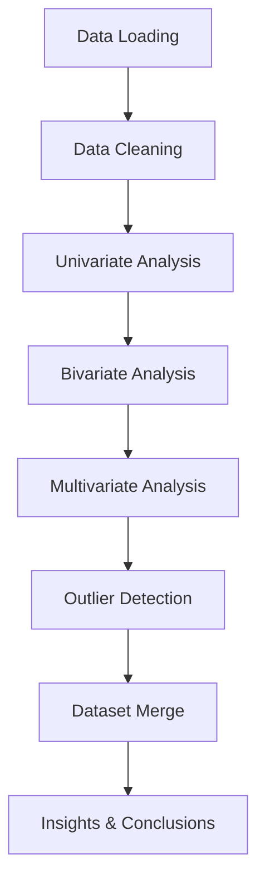

# Credit Risk Exploratory Data Analysis (EDA)

## 📌 Project Overview

This project performs a detailed **Exploratory Data Analysis (EDA)** on credit risk data to identify applicant behaviors, financial trends, and default patterns.
Two datasets are analyzed separately using the same EDA workflow and then **merged** for deeper insights.

---

## 📂 Datasets Used

### 1. **application\_data.csv**

* **Location:** `data/application_data.csv`
* **Description:** Contains information about **current loan applications**.
* **Size:** \~300,000 rows, \~120 columns.

**Key Columns**

* `SK_ID_CURR`: Unique client ID
* `TARGET`: Loan repayment status (`0` = repaid, `1` = default)
* `NAME_CONTRACT_TYPE`: Loan type (`Cash loans`, `Revolving loans`)
* `CODE_GENDER`: Gender of applicant
* `AMT_INCOME_TOTAL`: Annual income
* `AMT_CREDIT`: Loan amount requested
* `AMT_ANNUITY`: Yearly annuity
* `AMT_GOODS_PRICE`: Price of goods
* `NAME_EDUCATION_TYPE`, `NAME_FAMILY_STATUS`, `NAME_HOUSING_TYPE`: Demographics
* `DAYS_BIRTH`, `DAYS_EMPLOYED`: Age & employment details
* `EXT_SOURCE_1/2/3`: External credit scores

---

### 2. **previous\_application.csv**

* **Location:** `data/previous_application.csv`
* **Description:** Contains information about **previous credit applications**.
* **Size:** \~1,600,000 rows, \~37 columns.

**Key Columns**

* `SK_ID_CURR`: Unique client ID (links with application\_data)
* `SK_ID_PREV`: Previous loan ID
* `NAME_CONTRACT_TYPE`: Contract type (`Cash`, `Revolving`)
* `AMT_APPLICATION`: Amount applied for
* `AMT_CREDIT`: Amount approved
* `AMT_ANNUITY`: Loan annuity
* `NAME_CONTRACT_STATUS`: Loan status (`Approved`, `Refused`, `Canceled`, `Unused offer`)
* `DAYS_DECISION`: Days before current application decision
* `CNT_PAYMENT`: Number of installments

---

### 🔗 Dataset Merge

* Both datasets are merged on **`SK_ID_CURR`**.
* Enables linking **current application details** with **past application history**.
* Provides stronger insights (e.g., *past refusals → higher default probability*).

---

## 🔍 EDA Workflow (Step-by-Step)

### Step 1: Data Loading

* Loaded both datasets using **pandas**.
* Checked dataset shapes and memory usage.

### Step 2: Data Cleaning

* Removed duplicates.
* Handled missing values (e.g., filled or dropped depending on column importance).
* Converted negative values in `DAYS_BIRTH` and `DAYS_EMPLOYED` to meaningful positive age/employment values.
* Corrected inconsistent categorical entries.

### Step 3: Univariate Analysis

* **Application Data:** Distribution of loan types, gender, family status, housing, and education levels.
* **Previous Applications:** Loan statuses (`Approved`, `Refused`, etc.), contract types, loan amount distributions.

### Step 4: Bivariate Analysis

* Compared **income vs credit amount**.
* Analyzed **default rate across gender, education, and housing type**.
* Checked **past application status vs current default rate**.

### Step 5: Multivariate Analysis

* Built **correlation heatmaps** for financial attributes (credit, income, annuity, goods price).
* Identified strong/weak relationships among features.

### Step 6: Outlier Detection

* Used **boxplots and histograms** to find outliers in income, credit, annuity, and goods price.
* Flagged unrealistic values (e.g., extremely high incomes).

### Step 7: Dataset Merge

* Merged `application_data.csv` and `previous_application.csv` on `SK_ID_CURR`.
* Combined dataset enabled tracking of **how past loan history influences current repayment behavior**.

### Step 8: Insights & Conclusions

* Past **refusals** are strong predictors of defaults.
* Applicants with multiple **previous approvals** are more likely to repay.
* **Non-standard application hours** show higher default risk.
* Married applicants with secondary education form the majority.
* Outliers must be handled for reliable modeling.

---

## 🔄 EDA Workflow Diagram



---

## 🏁 Key Conclusions

* Most applicants are **working-class, married females** with secondary education.
* **Outliers** exist in income & credit features and must be handled.
* **Past refusals** significantly increase the chance of current defaults.
* Loan applications made at **odd hours/days** are riskier.
* Combining application and previous application data enhances predictive power.

---

## 🚀 Next Steps

* Perform **feature engineering** (handle outliers, encode categorical variables, scale features).
* Build **machine learning models** for credit default prediction.
* Create **interactive dashboards** for real-time risk monitoring.

---

## 📌 How to Run

1. Clone this repository:

   ```bash
   git clone <your-repo-link>
   cd credit-eda
   ```
2. Place datasets in the `data/` folder:

   ```
   data/application_data.csv
   data/previous_application.csv
   ```
3. Install dependencies:

   ```bash
   pip install -r requirements.txt
   ```
4. Run the notebook:

   ```bash
   jupyter notebook "Credit EDA.ipynb"
   ```

---

## 🖼️ Regenerating Plots

To regenerate plots outside the notebook, run:

```bash
python plots.py
```

This script:

* Loads datasets,
* Generates all required plots,
* Saves them inside the `plots/` folder.

---

## 📁 Repository Structure

```
├── Credit EDA.ipynb
├── data/
│   ├── application_data.csv
│   └── previous_application.csv
├── plots/                        # Visualization images
│   ├── application_loan_types.png
│   ├── application_gender.png
│   ├── application_income_credit.png
│   ├── application_heatmap.png
│   ├── previous_status.png
│   ├── previous_contract_types.png
│   ├── previous_amounts.png
│   ├── previous_heatmap.png
│   ├── merged_repayment.png
│   └── merged_default_risk.png
├── plots.py                      # Script to regenerate plots
├── README.md
└── requirements.txt
```

---

## 📦 Requirements

```txt
pandas
numpy
matplotlib
seaborn
